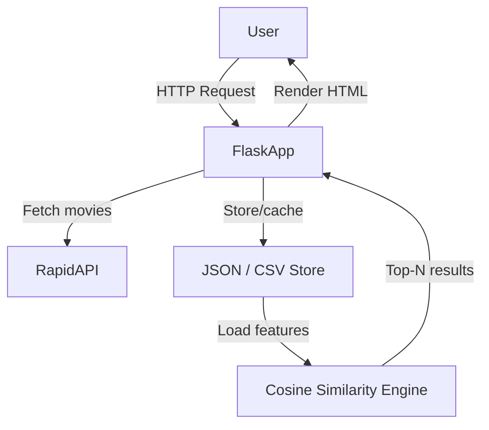
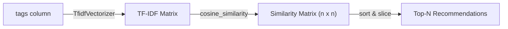

# Movie Recommendation System - Implementation Plan

## Architecture Overview

---

## Phase 1 — Project Setup

Goal: Establish project structure, virtual environment, and dependencies.

- Create directory structure:
  - `app/` — Flask app package
  - `app/templates/` — Jinja2 HTML templates
  - `app/static/` — CSS/JS assets
  - `data/` — cached movie data files
- Files to create: `requirements.txt`, `run.py`, `app/__init__.py`, `.env`
- Key dependencies: `flask`, `requests`, `python-dotenv`, `scikit-learn`, `pandas`, `numpy`

---

## Phase 2 — RapidAPI Integration

Goal: Connect to RapidAPI and fetch movie data.

- Choose a RapidAPI movie endpoint (e.g. **Movie Database (IMDB Alternative)** or **OTT Details**)
- Create `app/api.py` — wrapper with functions like `fetch_movies(genre, page)` and `fetch_movie_details(movie_id)`
- Store the `RAPIDAPI_KEY` and `RAPIDAPI_HOST` in `.env`, loaded via `python-dotenv`
- Write raw responses to `data/movies_raw.json` for offline use during development

---

## Phase 3 — Data Processing

Goal: Clean and structure raw API data into a usable format for the recommendation engine.

- Create `app/data_processor.py`
- Parse raw JSON → extract fields: `id`, `title`, `genre`, `description`, `rating`, `cast`, `keywords`
- Combine text fields (genre + description + cast) into a single `tags` column
- Save cleaned data to `data/movies_clean.csv` using `pandas`

---

## Phase 4 — Recommendation Engine

Goal: Build the Cosine Similarity model.

- Create `app/recommender.py`
- Use `sklearn.feature_extraction.text.TfidfVectorizer` on the `tags` column
- Compute `cosine_similarity` matrix from the TF-IDF vectors
- Expose a function `get_recommendations(movie_title, n=10)` that returns the top-N similar movies
- Serialize the similarity matrix with `pickle` so it does not recompute on every request

---

## Phase 5 — Flask Routes & Backend Logic

Goal: Wire the recommendation engine into Flask routes.

- Create `app/routes.py` with:
  - `GET /` — homepage, lists movies (with search/filter)
  - `GET /movie/<id>` — movie detail page
  - `GET /recommend/<movie_title>` — returns recommendations (JSON or rendered page)
- Load the clean CSV and similarity matrix at app startup (cached in memory)

---

## Phase 6 — Frontend (Templates & UI)

Goal: Build a clean, functional UI with Jinja2 templates.

- `templates/base.html` — shared layout with navbar
- `templates/index.html` — movie grid with search bar
- `templates/movie_detail.html` — movie info + recommended movies carousel
- Use Bootstrap 5 via CDN for styling; no build step required

---

## Phase 7 — Testing & Polish

Goal: Verify end-to-end functionality and harden the app.

- Add error handling for failed API calls (fallback to cached data)
- Add a data refresh route `GET /refresh-data` (admin only via secret key)
- Manual testing of recommendations for accuracy
- Add `README.md` with setup instructions and API key configuration steps
